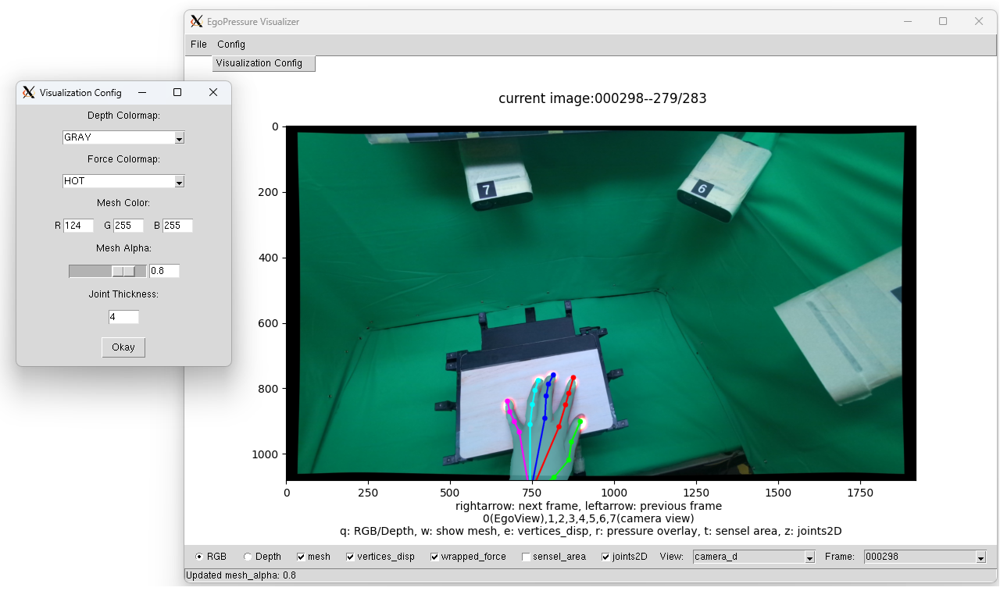

# EgoPressure Visualizer

This repo contains the application to visualize the **EgoPressure** Dataset.

## Requirement

We tested on Ubuntu 22.04 with Quadro RTX 6000 on a remote server.

### PyTorch

```
conda create --name EgoPressureVis python=3.10
conda activate EgoPressureVis
conda install pytorch==1.11.0 torchvision==0.12.0 torchaudio==0.11.0 cudatoolkit=11.3 -c pytorch
```

### PyTorch3D

We use PyTorch3D to render the mesh. Follow the instructions in [Pytorch3D 0.7.4](https://github.com/facebookresearch/pytorch3d/blob/v0.7.4/INSTALL.md)

```
conda install -c fvcore -c iopath -c conda-forge fvcore iopath
conda install -c bottler nvidiacub
conda install pytorch3d -c pytorch3d
```

### Manopath

Follow the instructions in [Manopth](https://github.com/hassony2/manopth) to install the mano

#### Download MANO models

* Go to [MANO Website](https://mano.is.tue.mpg.de/)
* Download ***MANO_LEFT.pkl MANO_RIGHT.pkl MANO_UV_left.obj MANO_UV_right.obj***
* Copy them to `EgoPressureVis/mano_models`

```
EgoPressureVis/
        mano_models/
            MANO_LEFT.pkl
            MANO_RIGHT.pkl
            MANO_UV_left.obj
            MANO_UV_right.obj
            ...
Path_to_Dataset/
       participant_1/
            calibration_routine_left/
            ...
       participant_2/
       ...
```

### Pip

```
pip install numpy==1.23.4 python-opencv matplotlib git+https://github.com/hassony2/chumpy.git
```

## GUI Visualizer

We suggets to use GPU to accelerate rendering

```
python visualize_egopressure.py --dataset_path Path_to_Dataset --device cuda:0
```



* **Load Data** `File`->`Load Recording`
* **Change Visualization** `Config`->`Visualization Config`
* **Shortcut** key 'q','w','e','r','t','z' change apperance, key '0'~'7' change camera view

### Video Export within GUI

* **Export Video** `File`->`Export Video`


### Video Export in commandline

We also provide the video export in commandline with following:

```
python -m models.make_video --sequence_path Path_to_Dataset/participant_1/calibration_routine_left --device cuda:0
```

`python -m models.make_video -h` to see all available options (argument type: default value)

* `--sequence_path ` Path to the folder of one recording sequence of the participant
* `--device` Device to run the model on, gpu will accelerate the rendering process
* `--fps` (int:30) frames per second
* `--frame_range` (list[int][2]: 0 -1) Range of frames to be visualized, -1 till the last frame of seq
* `--save_images` (bool:False) Enable to save images of each frame
* `--save_images_path` (str:'./video_frames') Path to save images of each frame
* `--save_video_path` (str:'./videos') Path to save video
* `--single_view_resolution` (list[int][2]: 640 360) Resolution of single view
* `--video_postfix_time` (bool:False) Add time postfix to video name
* `--visibility_RGB` (bool:True) Visualize RGB images
* `--visibility_depth` (bool:False) Visualize depth images, ignored if --visibility_RGB is True
* `--visibility_mesh` (bool:False) Visualize mesh
* `--visibility_vertices_disp` (bool:False) Apply vertices displacement
* `--visibility_wrapped_force` (bool:False) Visualize wrapped force map on image
* `--visibility_sensel_area` (bool:False) Visualize sensel touch pad area
* `--visibility_joints2D` (bool:False) Visualize 2D joints and skelton
* `--visibility_uv_pressure` (bool:False) Visualize pressure map on UV map
* `--visible_camera_views` (list[int]: 0) List of camera views to be visualized, 0(EgoCam),1,2,3,4,5,6,7(StaticCam),-1(no
  camera)
* `--visualization_config_depth_colormap` (str:'GRAY') Colormap for depth visualization,'GRAY','INFERNO','OCEAN','JET','HOT'
* `--visualization_config_force_color_map` (str:'OCEAN') Colormap for force visualization,'GRAY','INFERNO','OCEAN','HOT'
* `--visualization_config_mesh_color` (list[float][3]: 0.51 0.30 0.25) Color of the mesh, RGB value with range [0,1]
* `--visualization_config_mesh_alpha` (float:0.75) Transparency of the mesh of range [0,1]
* `--visualization_config_joint_thickness` (int:2) Thickness of the drawn 2d joints and skelton

### Video Frame


# SSH forward X11

Enable the visualization of dataset on a remote server

## 1. Install X11 on Your Local Machine

First, you need an X11 server installed on your local machine:

* For Windows: Install Xming or VcXsrv.
* For macOS: XQuartz is required. You can install it via Homebrew with ```$ brew install --cask xquartz```
* For Linux: X11 is typically **pre-installed** on most Linux distributions. If not, you can install it using your package manager, for example on Ubuntu/Debian: ``` sudo apt-get install xorg openbox```

## 2. Enable X11 Forwarding in SSH

* From a local Terminal on macOS or Linux:  ```$ ssh -X username@remote-server.com ```
* For local Windows using **PuTTY** and **XLaunch**:
  
  1. Open XLaunch
  2. Open PuTTY.
  3. Navigate to "Connection" -> "SSH" -> "X11".
  4. Check "Enable X11 forwarding".
  5. In Field "X display Location" with 127.0.0.1:0.0 (Usually, you can get with right click XLaunch in staus bar,click "Show log", find DISPLAY=xxx, put xxx in the Putty)
  6. Enter the SSH details for your server and connect as usual.
* Replace ```-X``` with ```-Y``` if you trust the remote server. The ```-Y``` option enables trusted X11 forwarding with less security checks.
* Ensure that the SSH server on the remote side is configured to allow X11 forwarding. This might involve setting ```X11Forwarding``` yes in the */etc/ssh/sshd_config* file and restarting the SSH

